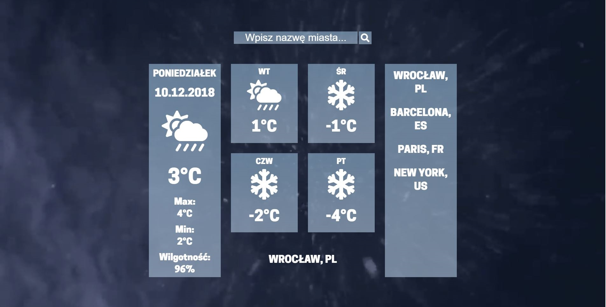
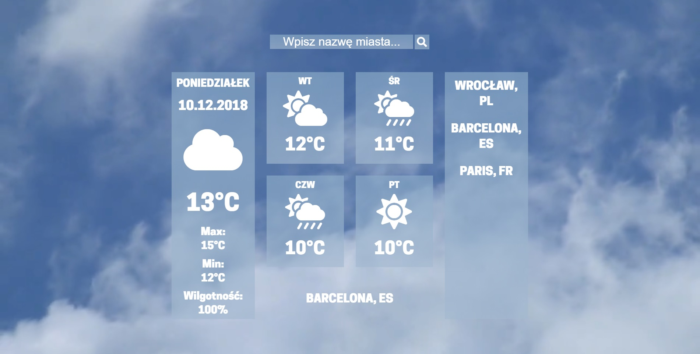
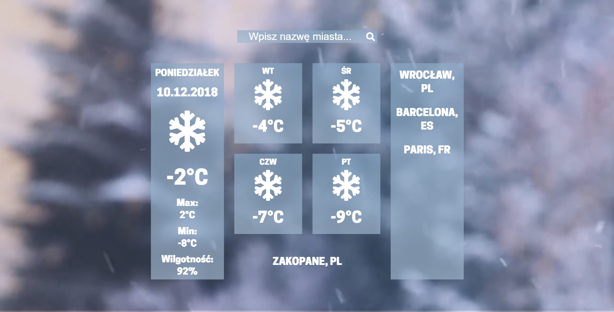

# CodersCamp Week3 - Weather page
It is third week of our course. This week we have developed our programing skills in JavaScript. Thanks to this project, you can check the weather for the next 5 days in 200,000 cities.
We display information such as: temperature (average, maximum, minimum), humidity and icons suitable to weather.

## Features

* The data has been fetched from Weather API (https://openweathermap.org/api).
* We display the weather for the next 5 days from now.
* The temperature value is the average of 8 measurements (every 3 hours)
* There are 9 weather states (for example: rain , snow, few clouds, thunderstorm e.t.c). For each of them we display suitable icon (https://fontawesome.com).
* After searching for a city, you can add it to your favourites. it will be remembered in the local storage. You can also delete city from favourites.
* We display 4 diffrent background videos depending on the current weather.

## Screenshots

## Setup
Just clone or download our repository and run index.html.

## Contact
Created by [@JędrzejZygadło](https://github.com/JedrzejZygadlo),[@karolsitarz](https://github.com/karolsitarz), [@jedrzejdrygas](https://github.com/jedrzejdrygas) and [@witoldolszyk](https://github.com/witoldolszyk).
